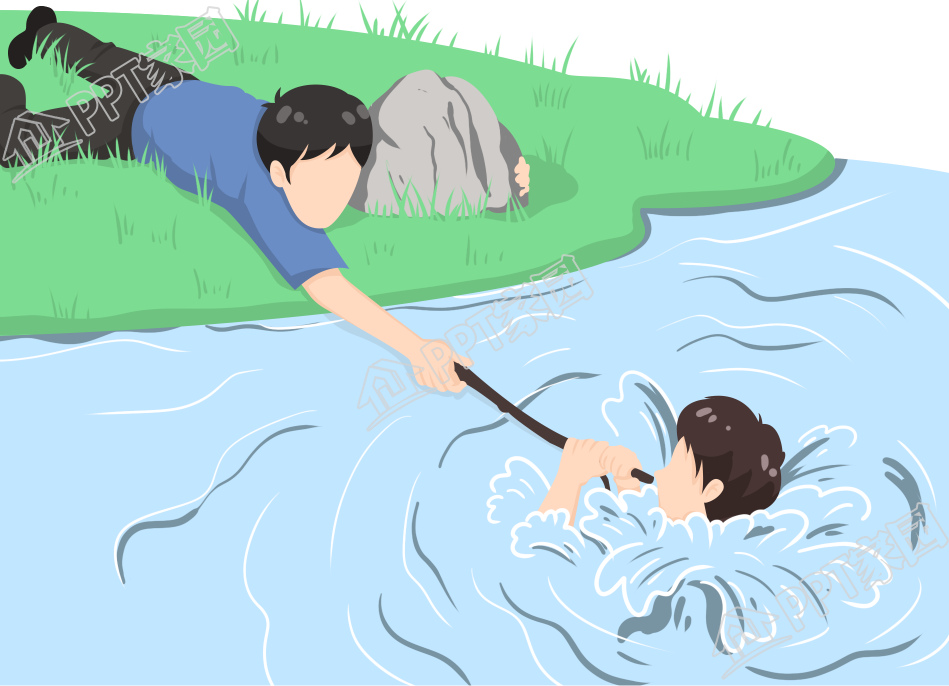

# 溺水

溺水是由于在液体中呼吸困难的过程，溺水会导致多个器官因缺氧而受损。

!!! warning "警告"
    淹溺急救对急救人员的要求很高，如果没有100%的把握切勿下水急救。

## 分类

溺水我们大致可以分为三种，湿性溺水、干性溺水、迟发性溺水[^1]

湿性溺水是喉部肌肉松弛，液体充塞气道和肺泡导致窒息。[^1]

干性溺水是喉头痉挛导致缺氧窒息，气道和肺泡内很少或无液体吸入。[^1]

迟发性溺水则是指在溺水获救一段时间或者游泳时呛水之后发生的反应。由于肺内的水没有完全排出，会面临二次死亡威胁，通常发生在几小时至72h之后，患者由于气体交换受阻、肺泡功能障碍，出现咳嗽、胸痛、呼吸困难等症状，严重者可窒息，甚至死亡。[^1]

## 识别溺水

识别溺水是就救治的第一步，有以下情况可能表明有人溺水 [^2]

- 不符合个人能力的行为或动作（例如，儿童独自在水中或在深水区游泳）。
- 他们不回答“你还好吗？”的问题。
- 他们的嘴在水下，或者他们正在喘气或喷溅。
- 他们似乎在呼吸困难。
- 他们的头在水下或面朝下。
- 他们的身体姿势已经从水平（游泳姿势）变为垂直（他们可能似乎在爬一个看不见的梯子）。
- 他们像水面上的水车一样将手臂向下推。
- 该人正试图向特定方向游泳，但没有取得任何进展。
- 这个人没有向任何方向移动，而是上下摆动。
- 最后一次出现在水中的人消失了。

## 救援

!!! warning "警告"
    淹溺急救对急救人员的要求很高，如果没有100%的把握切勿下水救援。

### 移出危险环境

如果溺水者有反应，施救人员可以提供悬浮物使得溺水者悬浮在水面上，避免事态进一步的恶化。不建议施救人员下水营救，因为这可能会使你一同溺水。施救人员可以提供泡沫板、木板等可以提供浮力的物品，协同绳子或竹竿帮助溺水人员脱离危险环境 (图1-1)

(图1-1)

如果溺水者已经没有反应，施救人员专业的情况下，可以尝试携带好救生衣或救生圈等装备，下水拖移溺水人员。

### 上岸护理

将溺水人员从水中移动到陆地或船只上，检查是否有反应，帮助他们开放气道并检查呼吸状况。根据情况来进一步诊断

#### 无反应但有呼吸

1. 如果你能保证患者没有脊柱或骨盆骨折，将患者至于复苏体位置 (图1-2)
2. 为患者身上盖上更多的衣服，保持患者体温，避免失温
3. 保持监控，随时准备急救，因为患者随身有可能进一步恶化

(图1-2)

#### 无反应且呼吸异常

1. 拨打急救电话，并告知你所在的位置
2. 打开患者的衣服
3. 两乳头中点处用掌根向下以快速且有规律的速度（每分钟 100-120 次按压）按压他们的胸部中央30次，嘴对嘴吹气两次
4. 重复步骤3，直到患者恢复生命迹象(咳嗽、呼吸、睁开眼睛、说话等)或急救人员到来

!!! warning "注意"
    1. 期间患者可能会出现呛咳、呕吐，准备好将它们的头转动到另一侧
    2. 在进行心肺复苏术时，请注意任何生命迹象，例如运动或咳嗽。 如果您看到任何生命迹象，请暂停心肺复苏术最多十秒钟，以查看该人是否可以自行呼吸。
    3. 如果不愿意进行人工呼吸，请保持每分钟100-120次的胸外按压，直到急救人员的到来
    4. 如有AED，请尽快使用。使用时，请擦拭电极片接触的皮肤，然后按照语音提示来操作

### 对于干性溺水与迟发性溺水的救援

干性溺水是喉头痉挛导致缺氧窒息，气道和肺泡内很少或无液体吸入，通常是一种应激反应。迟发性溺水则是指在溺水获救一段时间或者游泳时呛水之后发生的反应。由于肺内的水没有完全排出，会面临二次死亡威胁，通常发生在几小时至72h之后，患者由于气体交换受阻、肺泡功能障碍，出现咳嗽、胸痛、呼吸困难等症状，严重者可窒息，甚至死亡。[^1]

干性溺水与迟发性溺水，通常情况急救人员难以立刻发现。下面是对于干性溺水与迟发性溺水的急救[^1]

- 如自身离开水域后，出现咳嗽、嗜睡等不适症状请立即就医
- 如自身离开水域后，出现口唇齿干、呼吸困难，立即平躺并后仰打开呼吸道，并拨打120尽快前往医院
- 如患者出现了休克，要立即进行心肺复苏到急救人员的到来。

### 预防

1. 远离开放水域
2. 设置屏障，控制接近水域
3. 教学龄儿童（6岁以上）学会游泳和水上安全技能
4. 在封闭水域设置救生员

